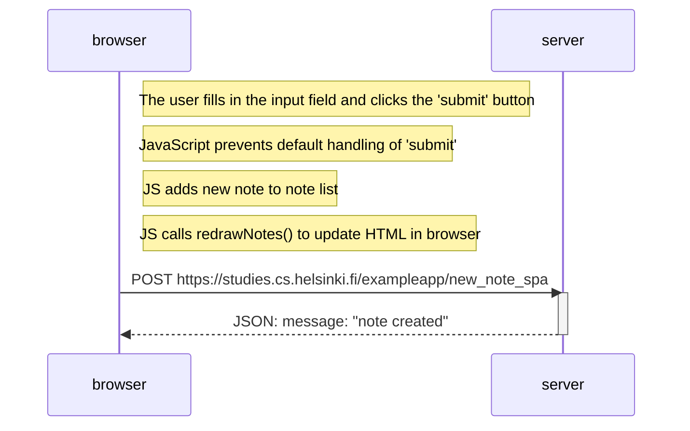

```mermaid
sequenceDiagram
    participant browser
    participant server

    Note right of browser: The user fills in the input field and clicks the 'submit' button

    Note right of browser: JavaScript prevents default handling of 'submit'

    Note right of browser: JS adds new note to note list

    Note right of browser: JS calls redrawNotes() to update HTML in browser

	browser->>server: POST https://studies.cs.helsinki.fi/exampleapp/new_note_spa
	activate server
	server-->>browser: JSON: message: "note created"
	deactivate server
```
